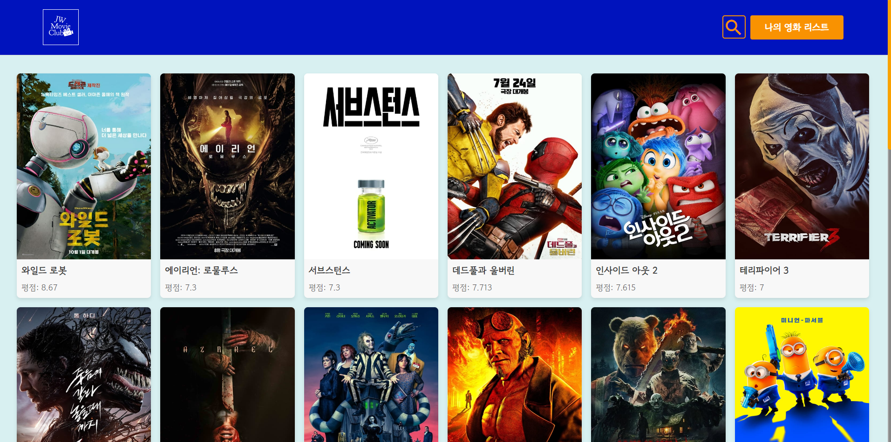
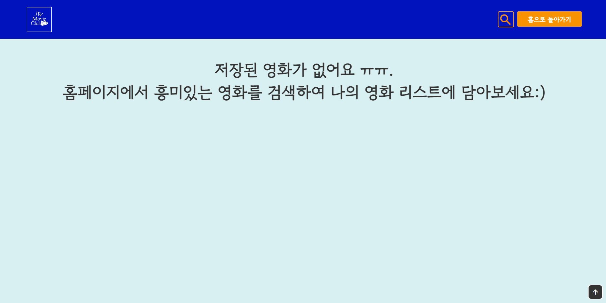
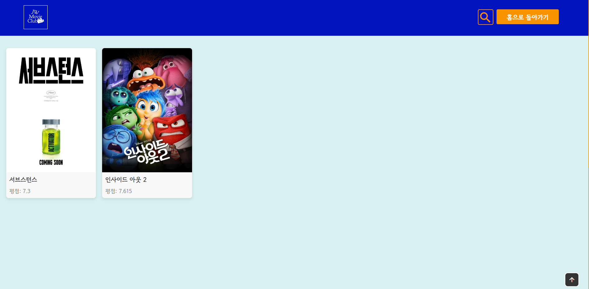
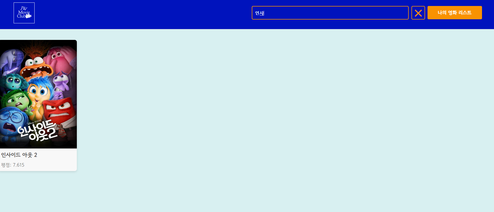
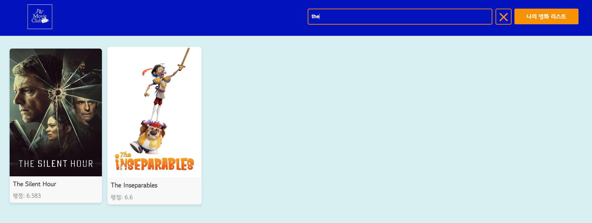
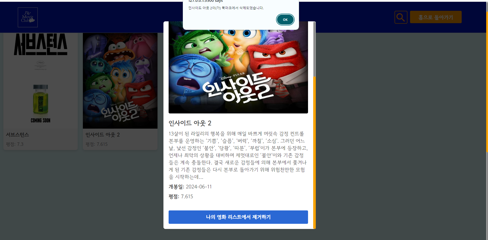
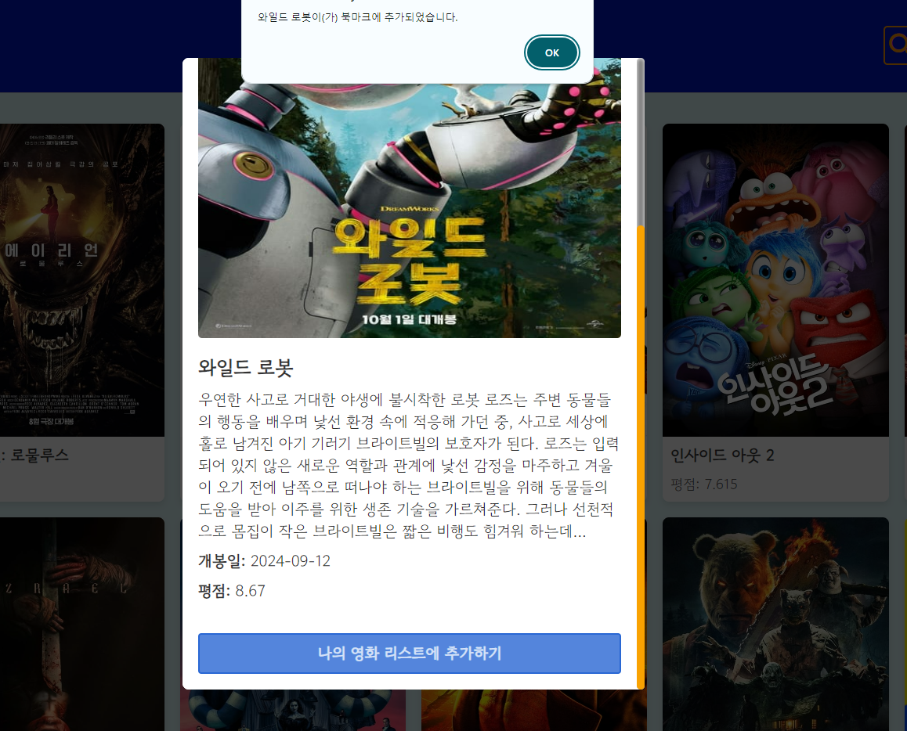
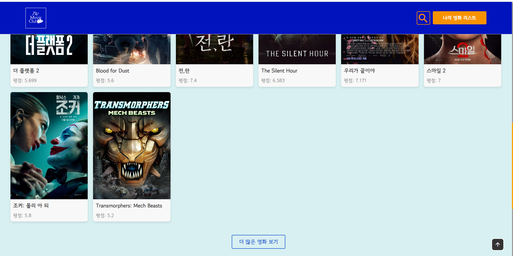

# 영화 검색 사이트

- HTML, CSS, JS로만 만든 영화 검색 사이트.

https://fascinating-pothos-e84b02.netlify.app/

## 구성

- Home Page: TMDB에서 불러온 영화 정보들을 기반으로 사용자가 영화 검색을 할 수 있고, 각각의 영화 정보들은 반응형 카드 디자인에 담겨있다. 사용자들은 카드를 클릭하여 각 영화의 세부정보를 볼 수 있다. 각각의 영화 카드들은 사용자들이 북마크 버튼을 클릭함과 동시에 My Movie List 에 저장된다.

- My Movie List Page: 사용자들은 저장한 영화 리스트들은 이 해당 페이지에서 볼 수 있고, 각각의 영화 카드의 북마크는 제거될 수 있다. 이 My Movie List Page내에서도 사용자들이 저장한 영화 목록 안에서 검색을 할 수 있다. 홈페이지로 돌아가기 버튼으로 쉼게 홈페이지로 돌아갈 수 있다.

## 기능

- 실시간 영화 검색 기능: 영어 대소문자 관계 없이 검색할 수 있고, 키워드를 치면 자동으로 해당 결과가 화면에 표시된다.

- 이벤트 기능: event.target (이벤트 위임)을 이용해서 동적으로 생성된 요소에 이벤트를 효율적으로 처리해보았다.

- 북마크 기능: localstorage를 이용해 북마크 기능을 수행했다.

- 영화 카드 리스트 UI: Grid 레이아웃을 이용해 반응형 디자인을 구현했다.

- TMDB API 연동: TMDB API에서 데이터를 가져오고, API 키를 통해 데이터 요청을 처리했다. async/await으로 API호출을 refactoring했다.

- 더보기 버튼: 더 많은 영화를 보고 싶다면, '더 많은 영화 보기' 버튼을 클릭해서 계속해서 많은 영화 정보들을 찾아 볼 수 있다.

